# Presentaciones efectivas

---

---

## Muerte por powerpoint

---

## Algunas preguntas antes de empezar 

---

### ¿Quién es la audiencia?

---

---

### ¿Cuánto tiempo?

---

### ¿Qué mensaje?

---

### ¿Cuál es el objetivo?

---

### ¿Dónde es la presentación?

---

### ¿Qué medios tengo a mi alcance?

---

## Estructura

---

### Elemento o ideas que puedo meter a mi presentación

---

> Presentar es seleccionar y compartir ideas

---

### Definir el orden de los elementos 

---

### Planear en papel, lápiz y a mano

---

## Diseño 

---

## ¡Ya haremos las diapositivas!
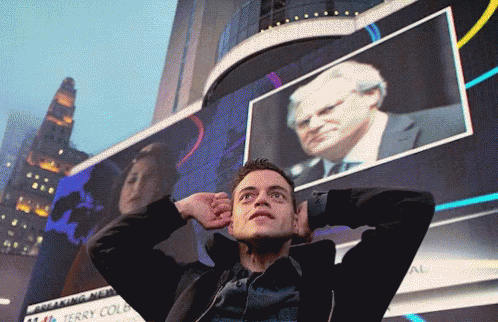

---

### El diseño también comunica

---

## El zen en presentar

---

### La simplicidad
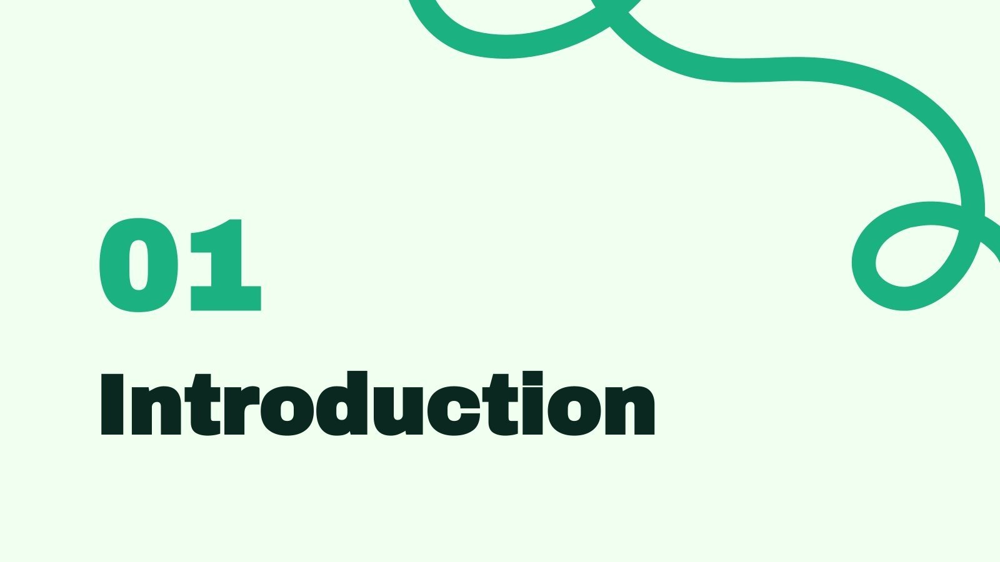

---

### La claridad

---

### La armonía
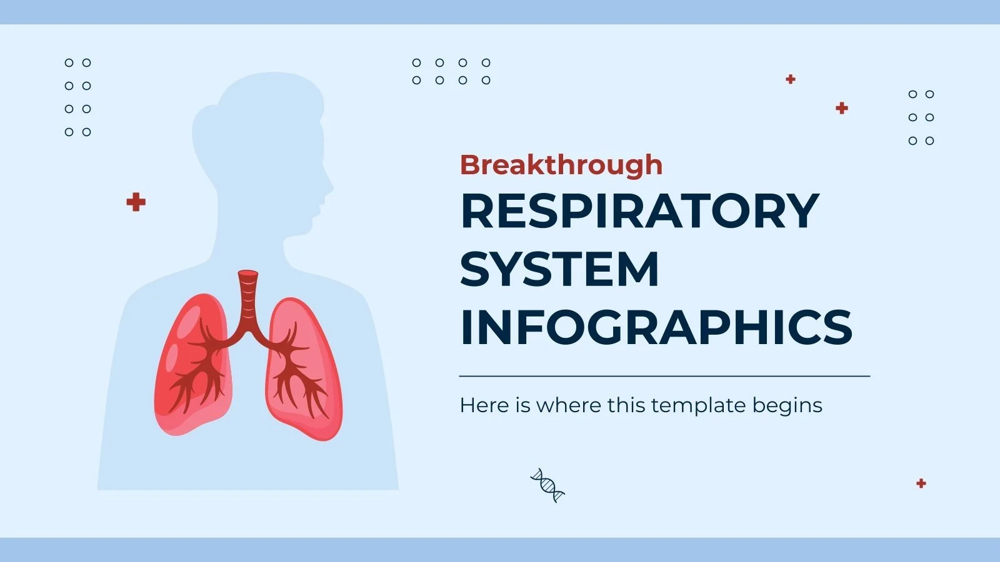

---

## El diseño de las diapositivas

---

### El tema y la tipografía

---
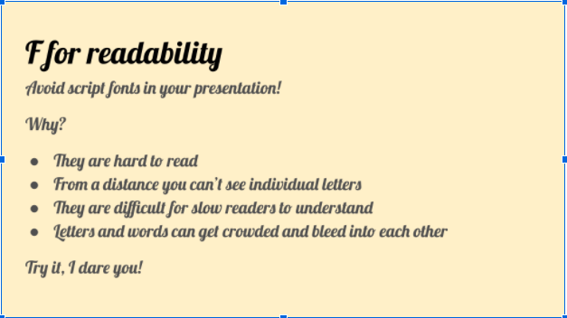

---

### Los colores y los contrastes
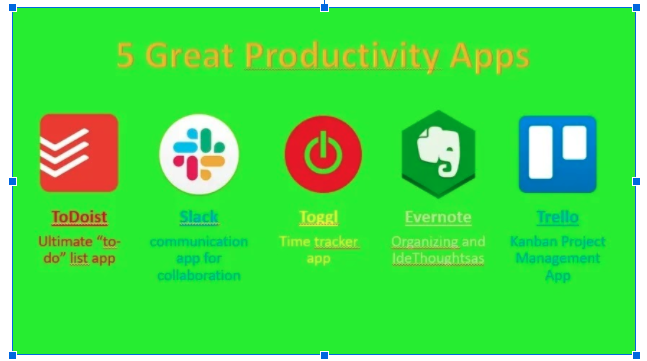

---

### La regla del 10/20/30

---

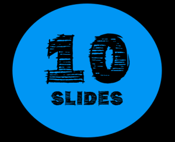

---
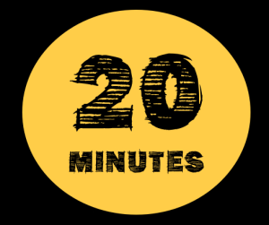

---
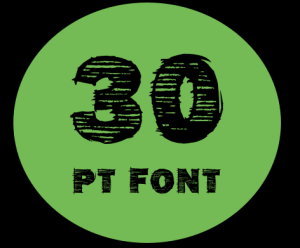

---

## Errores

---

### PowerPoint como teleprompter 

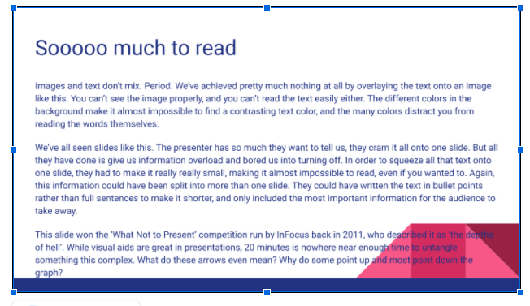

---

### El abuso de los bullet point's
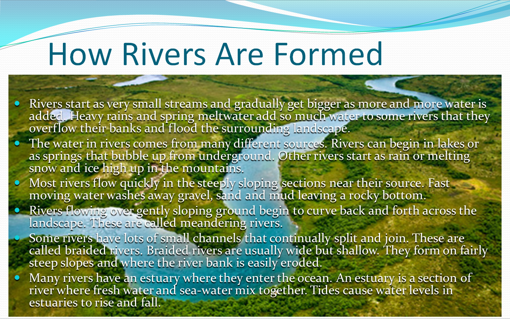

---
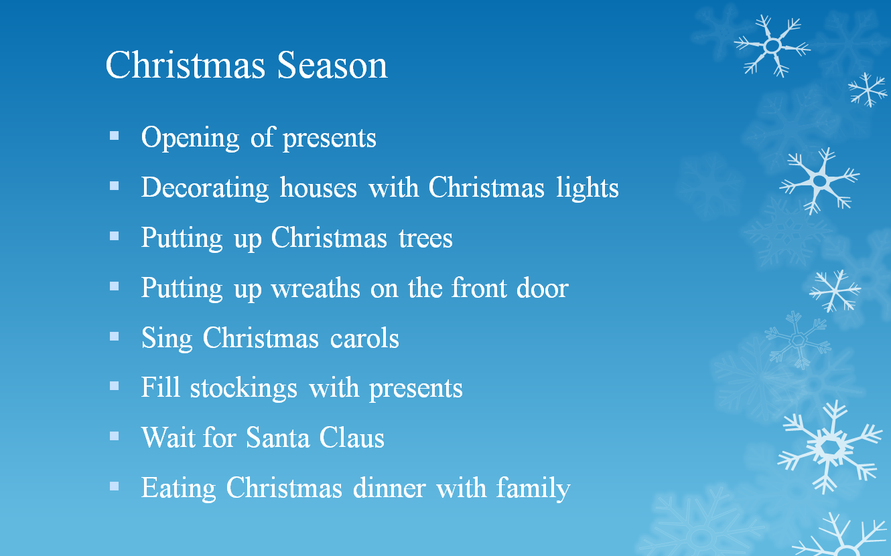

---

### Una mala elección de colores

---

### Faltas de ortografía

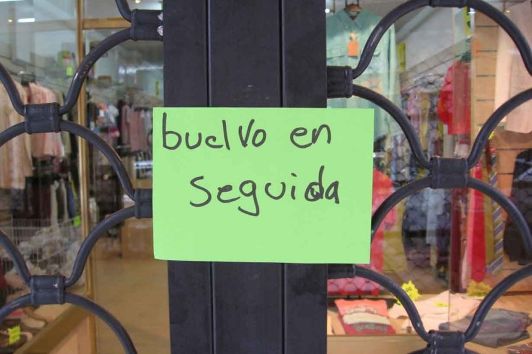

---

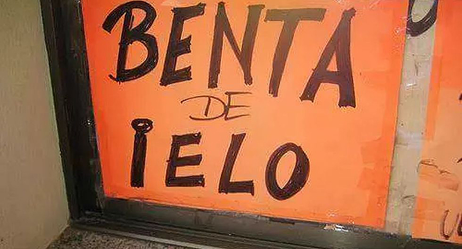

---

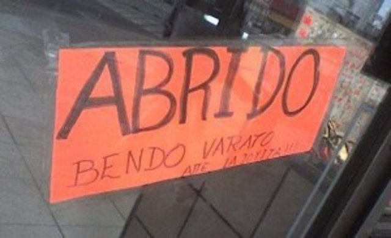

---

### Demasiada animación

