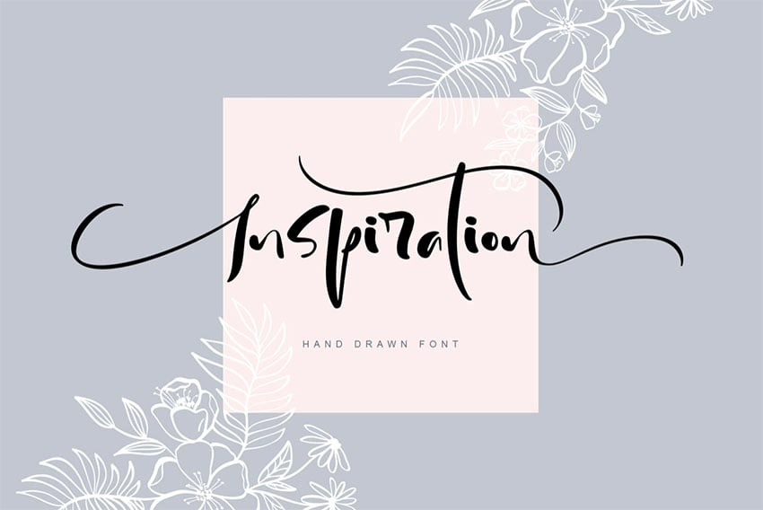
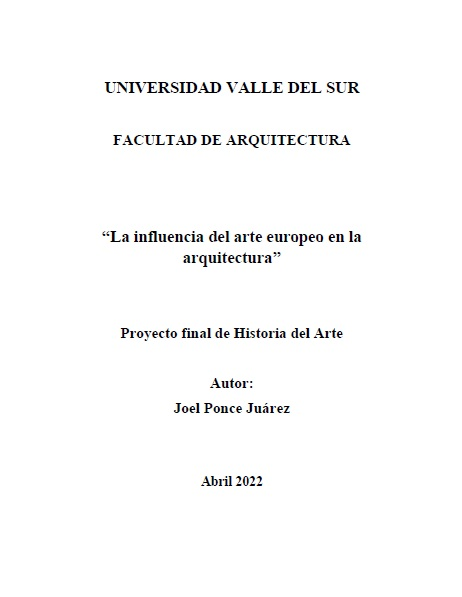
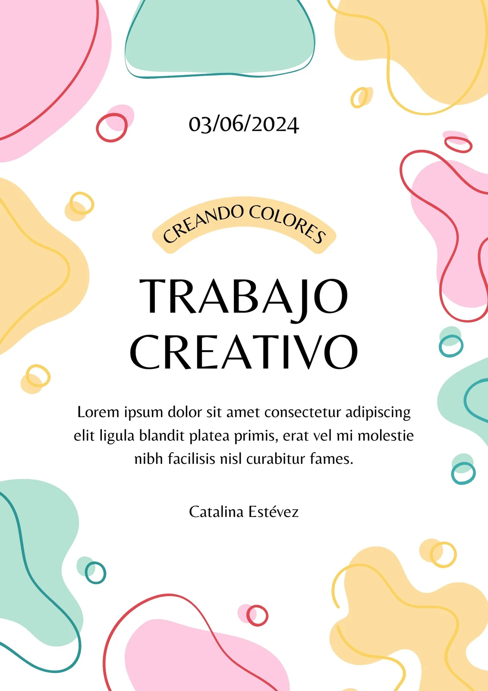
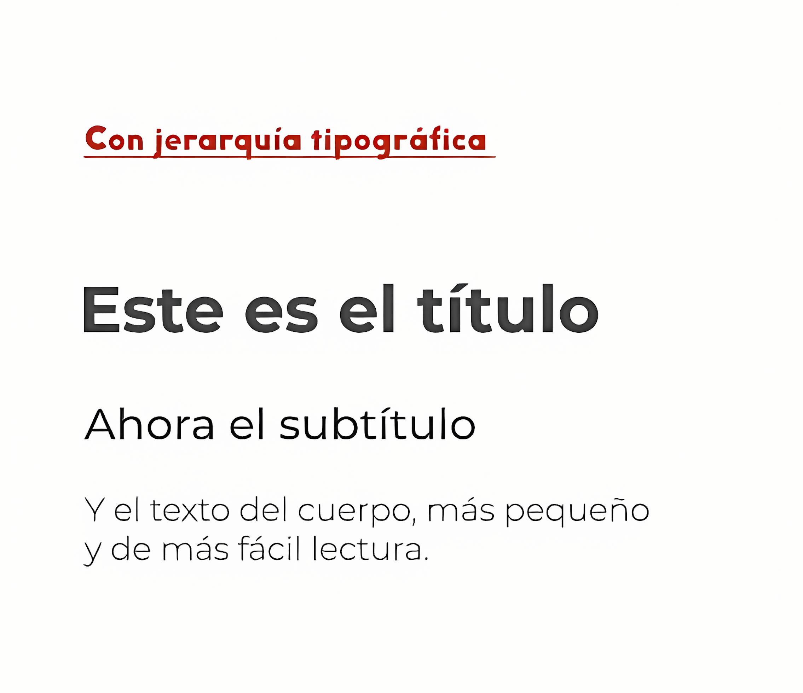
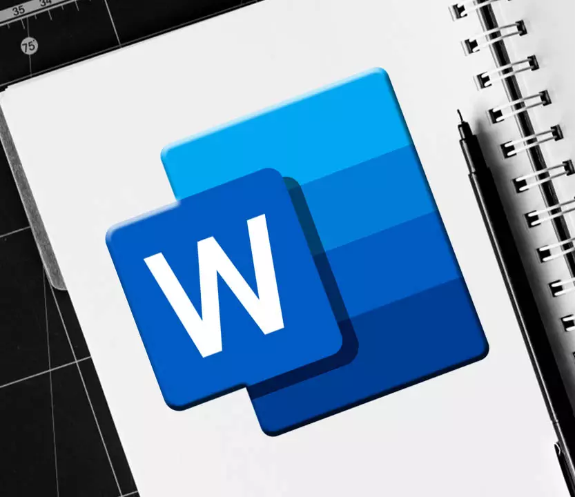
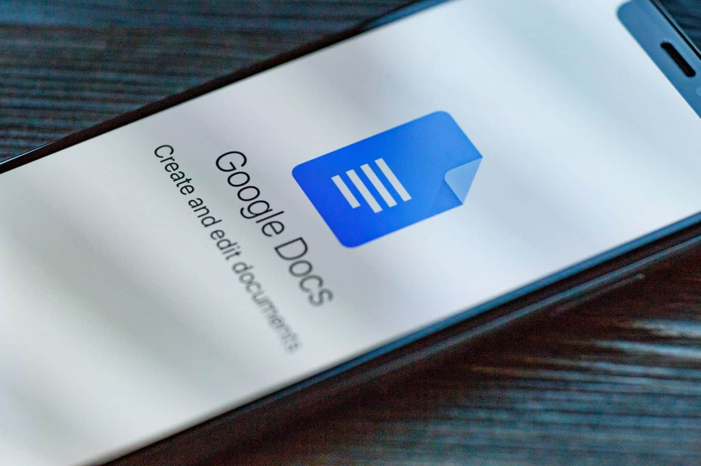
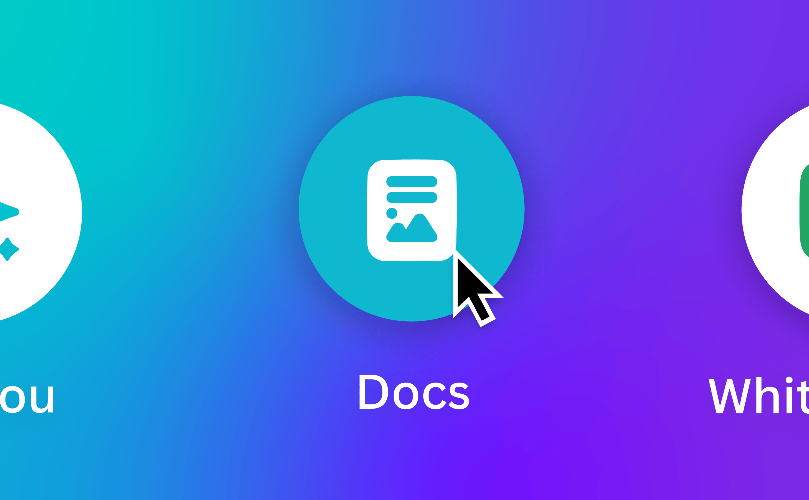
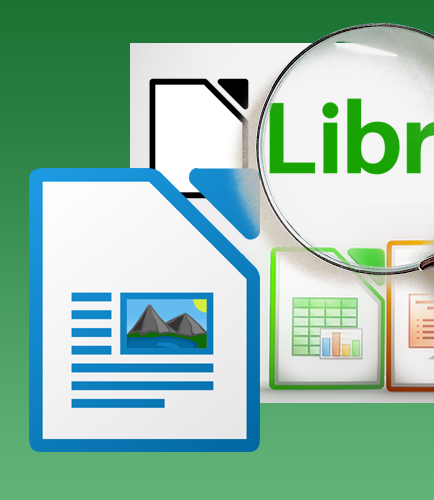

# Presentaciones efectivas

---

---

## Muerte por powerpoint

---

## Algunas preguntas antes de empezar 

---

### ¿Quién es la audiencia?

---

---

### ¿Cuánto tiempo?

---

### ¿Qué mensaje?

---

### ¿Cuál es el objetivo?

---

### ¿Dónde es la presentación?

---

### ¿Qué medios tengo a mi alcance?

---

## Estructura

---

### Elemento o ideas que puedo meter a mi presentación

---

> Presentar es seleccionar y compartir ideas

---

### Definir el orden de los elementos 

---

### Planear en papel, lápiz y a mano

---

## Diseño 

---

## ¡Ya haremos las diapositivas!

---

### El diseño también comunica

---

## El zen en presentar

---

### La simplicidad

---

### La claridad

---

### La armonía

---

## El diseño de las diapositivas

---

### El tema y la tipografía

---

---

### Los colores y los contrastes

---

### La regla del 10/20/30

---

---

---

---

## Errores

---

### PowerPoint como teleprompter 

---

### El abuso de los bullet point's

---

---

### Una mala elección de colores

---

### Faltas de ortografía

---

---

---

### Demasiada animación

---

<!-- PORTADA -->
# Diseño de Documentos Profecionales  

<!-- NOTAS: 
Iniciar con pregunta retórica: "¿Alguna vez han entregado un trabajo que parecía bueno pero les bajaron puntos por formato?"
Explicar que hoy aprenderán técnicas profesionales pero simples. 
Mencionar que usaremos ejemplos del Metro CDMX para hacerlo más tangible.
-->

---

<!-- ESTRUCTURA 1 -->
# Primera Impresión  
La portada como carta  
de presentación visual

<!-- NOTAS:
Mostrar ejemplo de portada básica vs. profesional usando plantilla de la SEP
Detallar los 4 elementos clave: título impactante, nombre completo, grupo, materia y fecha
Recomendar incluir código de colores de la escuela
-->

---

---

---

---

<!-- ESTRUCTURA 3 -->

### Introducción que engancha  
Fórmula probada:  
Contexto + Propósito + Método

<!-- NOTAS:
Ejemplo práctico: "En CDMX se generan 13,000 toneladas de basura diaria... por eso investigaremos..."
Enseñar a usar preguntas retóricas relevantes
Error común a evitar: ser demasiado general
-->

---

<!-- DISEÑO 1 -->
# El poder del color  
en documentos Profecionales

<!-- NOTAS:
Hacer votación rápida: ¿Qué color asociamos a profesionalismo?
Revelar que el azul institucional aumenta percepción de credibilidad
Mostrar paleta de CDMX (rosa mexicano, azul, blanco) y cómo usarla
-->

---

<!-- TIPOGRAFÍA 1 -->
# Voces visuales  
Cómo elegir fuentes  
que comunican

<!-- NOTAS:
Preguntar: ¿Qué sentirían si un trabajo sobre historia está en Comic Sans?
Mostrar comparación Calibri vs Times New Roman en documentos impresos
Revelar que el 92% de los profesores prefieren sans serif
-->

---

<!-- TIPOGRAFÍA 2 -->
### Jerarquía tipográfica  
para guiar la lectura

Títulos firmes  
Subtítulos claros  
Texto amigable

<!-- NOTAS:
Regla práctica: el título debe leerse desde 2 metros de distancia
Mostrar sistema de escalado: 36pt - 28pt - 24pt
Ejemplo con encabezados de periódicos locales
-->

---

---

<!-- CONTRASTE 1 -->
# Lectura sin esfuerzo  
El secreto está en  
el contraste

<!-- NOTAS:
Experimento práctico: mostrar texto gris claro sobre blanco vs negro sobre beige
Enseñar herramienta de verificación de contraste WebAIM
Importancia para estudiantes con problemas visuales
-->

---

<!-- CONTRASTE 2 -->
### Combinaciones seguras  
para documentos profecionales

Texto oscuro  
sobre fondo claro  
= Máxima legibilidad

<!-- NOTAS:
Excepción controlada: usar color inverso solo para recuadros destacados
Mostrar ejemplos de documentos de la UNAM como referencia
-->

---

<!-- HERRAMIENTAS 1 -->
# Tecnología aliada  
Programas esenciales  

<!-- NOTAS:
Preguntar por experiencia con programas de diseño
Aclarar que no se necesita Adobe caro - versatilidad de Word
-->

---

<!-- HERRAMIENTAS 2 -->
### Microsoft Word  
Funciones secretas  
que pocos usan

Estilos predefinidos  
Navegación rápida  
Tablas automáticas

<!-- NOTAS:
Demostración en vivo de cómo aplicar estilos
Atajos clave: Ctrl+Alt+1 para título principal
Ventaja: compatibilidad con todos los equipos escolares
-->

---

<!-- HERRAMIENTAS 3 -->
### Google Docs  
Colaboración en tiempo real  
desde cualquier dispositivo

<!-- NOTAS:
- Ideal para trabajos grupales: mostrar historial de revisiones
- Integración con Google Drive: acceso desde celular
- Plantillas académicas predefinidas
- Ejemplo práctico: organizar equipo para proyecto del Metro CDMX
-->

---

<!-- HERRAMIENTAS 4 -->
# Diseño sin complejos  
Con Canva para académicos

<!-- NOTAS:
- Romper mito: "Canva no es solo para redes sociales"
- Mostrar plantillas de informes académicos
- Demostrar creación rápida de infografía sobre contaminación atmosférica
-->

---

<!-- HERRAMIENTAS 5 -->

### Canva en acción  
3 usos académicos:  
1. Portadas dinámicas  
2. Diagramas explicativos  
3. Presentaciones visuales

<!-- NOTAS:
- Enseñar a usar paleta CDMX en diseños
- Exportar como PDF imprimible
- Biblioteca de iconos locales (metrobús, ajolotes, etc.)
-->

---

<!-- HERRAMIENTAS 6 -->
### LibreOffice  
Potencia gratis  
y abierta

<!-- NOTAS:
- Comparativa con Word: ventajas y desventajas
- Ideal para equipos antiguos en escuelas públicas
- Guardar en formato .doc para compatibilidad
-->

---

<!-- HERRAMIENTAS 7 -->
# Flujo híbrido  
Combinando herramientas

Word + Canva =  
Documentos técnicos  
con toque visual

<!-- NOTAS:
- Insertar gráficos de Canva en Word
- Mantener consistencia de colores
- Ejemplo: Reporte sobre rescate de Xochimilco
-->

---

<!-- HERRAMIENTAS 8 -->

### Comparativa rápida  
¿Cuándo usar cada cual?

- **Word/LO**: Texto denso  
- **Google Docs**: Colaboración  
- **Canva**: Elementos visuales  
- **Illustrator**: Gráficos técnicos

<!-- NOTAS:
- Recomendar según tipo de proyecto y equipo
- Mostrar tabla comparativa en pantalla
- Enfatizar que son complementarias
-->
