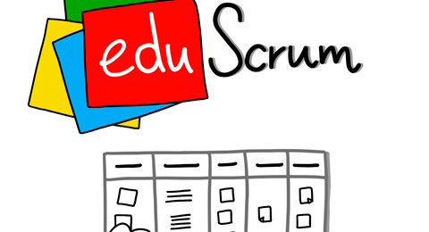
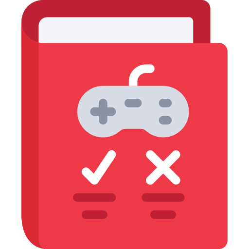
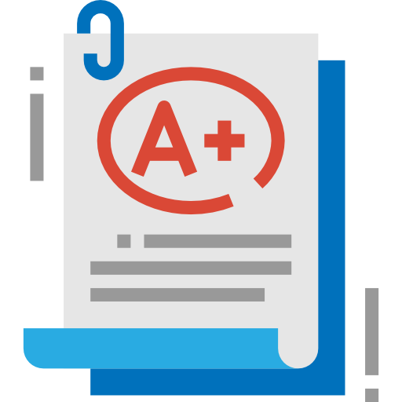
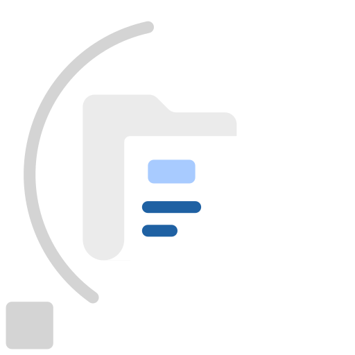
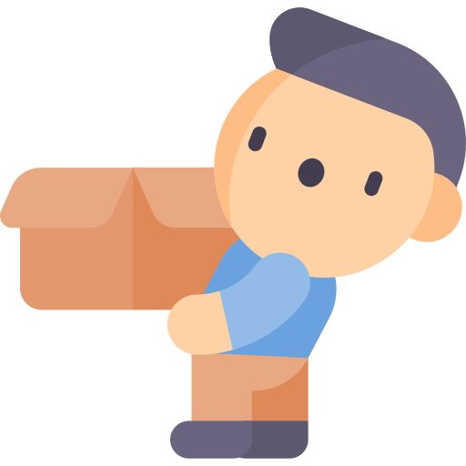
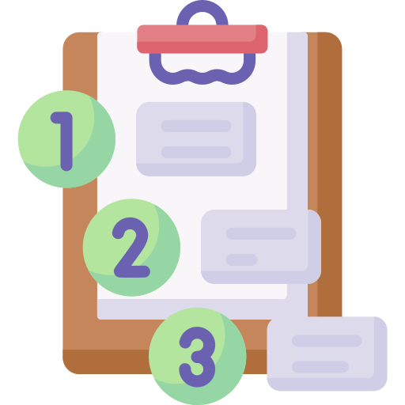
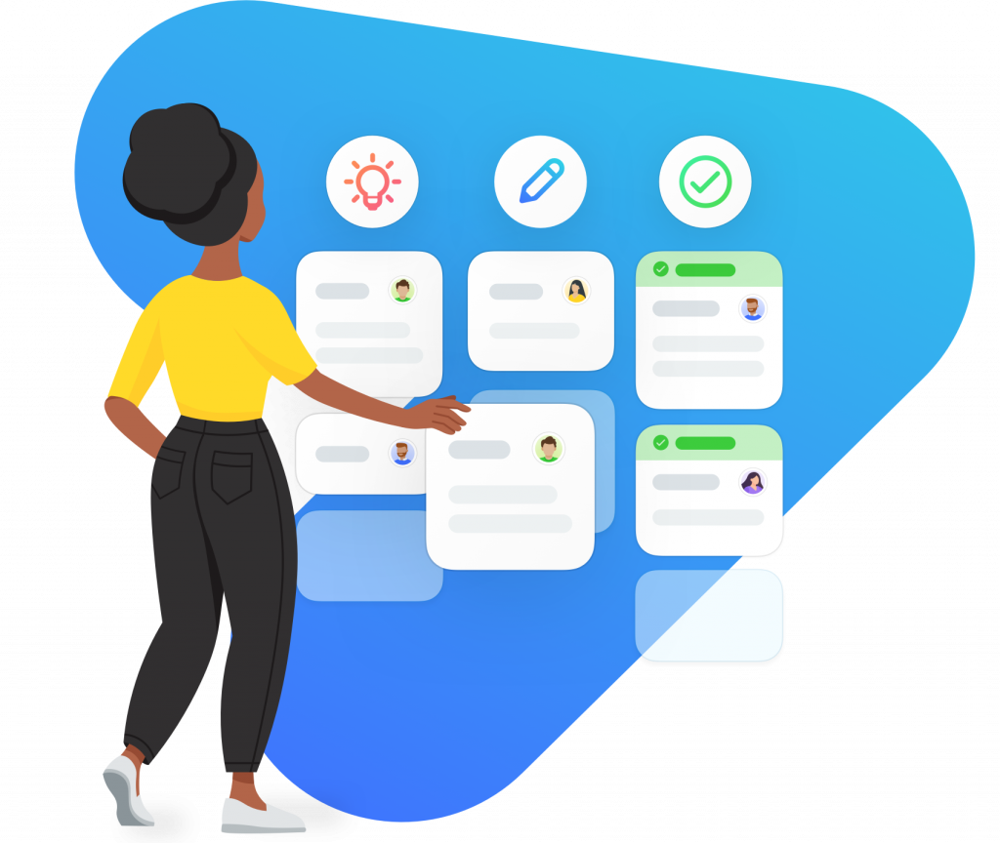
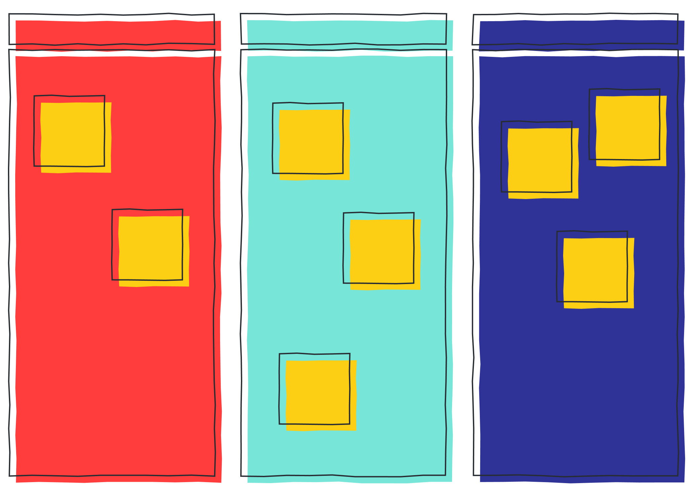
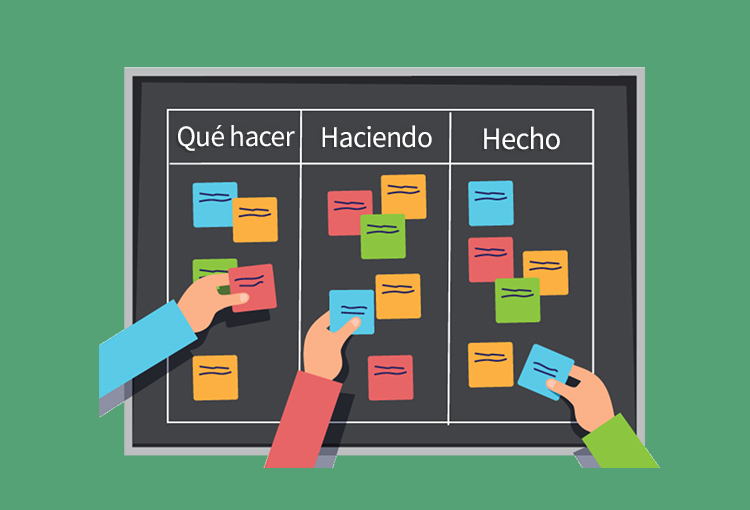
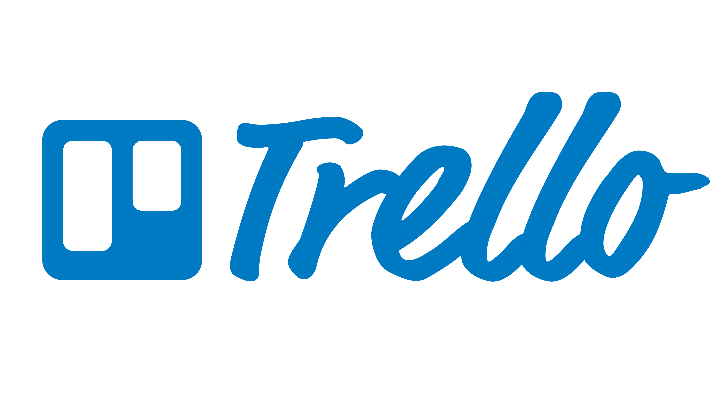

# Desarrollo ágil de proyectos

---

---

### Scrum

Marco de trabajo en grupo orientado a la realización de tareas en cortos períodos de tiempo por grupos pequeños (equipos de 4 a 8  personas, aproximadamente).

---

## ¿Qué es eduScrum?

Un marco de trabajo en el que los estudiantes pueden hacer frente a problemas adaptativos complejos, mientras logran objetivos de aprendizaje y crecimiento personal

---

### Filosofía y Normas

---

Responsabilidades al adoptar eduScrum, incluyendo trabajar en clanes autoorganizados.

---

Calificación a nivel de grupo y compromiso entre los miembros del clan.

---

#### Responsabilidades

Trabajar al mismo nivel, asistencia regular, colaboración, respeto y enfoque en el aprendizaje.

---

Énfasis en la inspección y adaptación con una retrospectiva al final de cada ciclo.

---

### Sprint

---

Un Sprint es un marco temporal definido para objetivos de aprendizaje.

---

Responsabilidad del clan de entregar un producto válido y alcanzar objetivos de aprendizaje individuales al final del sprint.

---

### Scrum Master

Garantizar la correcta ejecución del proceso, incluyendo facilitar las reuniones

---

### Product Backlog

---

Lista ordenada de tareas que contribuyen a los objetivos de aprendizaje.

---

Tareas que pueden realizarse de manera independiente, y algunas pueden subdividirse por el clan.

---

### Reunión de Planificación

* Planificación del trabajo (generación de la lista de tareas).
* Estimación de las tareas

---

Al finalizar esta reunión, el clan de trabajo debe explicar al dueño del producto (profesor) un resumen de las decisiones tomadas y las estrategias adoptadas para abordar el proyecto.

---

### Reunión Diaria (Reunión de pie)

* Preguntas que cada miembro responde.
* Importancia del Scrum Master en recordar a los miembros la reunión

---

#### Preguntas Reunión diaria

* ¿Qué trabajo he aportado al clan desde la última reunión?
* ¿Qué trabajo voy a hacer durante esta clase?
* ¿Qué impedimentos tengo para alcanzar mis objetivos?

---

### Revisión del Sprint (Demo)

* Cada clan presenta sus desarrollos a la clase.
* Compañeros proporcionan comentarios constructivos y objetivos.

---

### Retrospectiva

---

El clan analizarán las estrategias de trabajo que han seguido para identificar qué puntos han funcionado bien y qué puntos pueden mejorar.

---
Cada miembro del clan analizará sus puntos fuertes y puntos débiles.

---

El clan decidirá qué debe dejar de hacer.

---

Tanto el clan (colectivo) como cada miembro (individual) deberá responder a 4 preguntas:

* ¿Qué fue bien?
* ¿Qué se puede mejorar?
* ¿Qué no se debe hacer más?
* ¿Qué voy a hacer (una cosa) para mejorar en el siguiente mundo?

---

.jpg)

---

### ¿Qué es Kanban?

Es una forma de ayudar a los equipos a encontrar un equilibrio entre el trabajo que necesitan hacer y la disponibilidad de cada miembro del equipo

---

* Se basa en una filosofía centrada en la mejora continua

* Las tareas se “extraen” de una lista de acciones pendientes en un flujo de trabajo constante.

---

Visualización simple como un tablero con columnas como "POR HACER", "EN PROCESO" y "COMPLETADO"

---

### Funcionamiento Básico de Kanban

* Las tarjetas Kanban representan tareas.
* Movimiento de tarjetas desde "BACKLOG" a "POR HACER" y luego a "EN PROCESO" y "COMPLETADO".
* Facilidad de controlar el trabajo y seguir el progreso.

---

### Tablero Kanban

Permite a los equipos visualizar sus flujos de trabajo y la carga de trabajo

---

El trabajo se muestra en forma de tablero organizado por columnas. 

Cada columna representa una etapa del trabajo

---

El tablero más básico puede presentar columnas como Trabajo pendiente, En progreso y Terminado.

---

Las tareas individuales —representadas por tarjetas visuales en el tablero— avanzan a través de las diferentes columnas hasta que estén finalizadas.

---

---

### ¿Qué es Trello?

* Permite idear, planificar y gestionar objetivos de manera colaborativa.

* Facilita la celebración de logros de equipos de forma productiva y organizada

---

* Ideal para iniciar nuevos proyectos o mejorar la organización de proyectos en curso.

* Simplifica y estandariza procesos de trabajo de forma intuitiva.

---

### Componentes clave de un tablero

Tablero, lista, tarjeta y menú del tablero

---

### ¿Qué es un tablero en Trello?

* Lugar para hacer seguimiento de información sobre proyectos, equipos o flujos de trabajo.
* Organización de tareas y detalles, fomentando la colaboración.

---

### ¿Qué es una lista en Trello?

* Contiene tarjetas organizadas por fases de progreso.
* Utilizada para flujos de trabajo o seguimiento de ideas e información.

---

### ¿Qué es una tarjeta en Trello?

* Elemento más pequeño y detallado del tablero, representa tareas e ideas.
* Personalizable con información útil y se organiza en listas.

---

# EJEMPLO

https://trello.com/home

