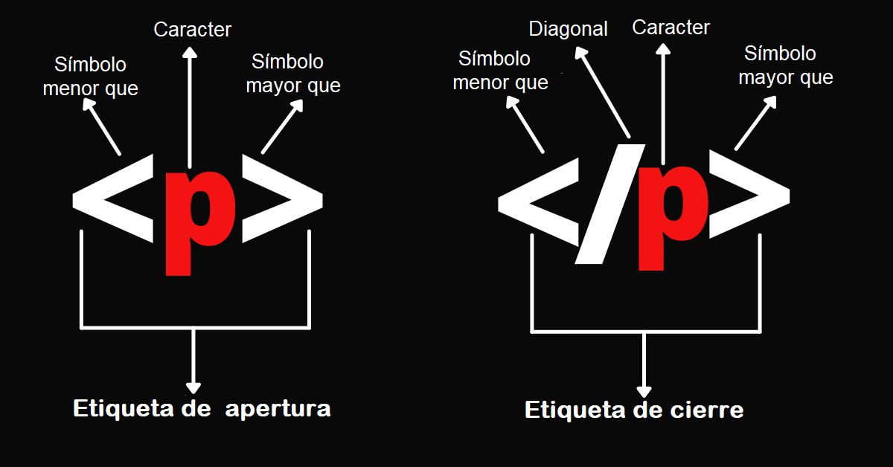
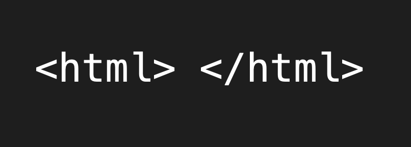

# HTML

### como base de la web

---

## Define estructura y significado del contenido

---

## Tecnologías complementarias

---

### CSS para diseño

---

### JavaScript para funcionalidad 

---

## Hipertexto y enlaces

---

### Conecta páginas web entre sí 

---

### Es fundamental en la Web 

---

## Marcas HTML y elementos 

---

### Etiquetan texto, imágenes y otros contenidos

---

### Facilitan la visualización en navegadores web 

---

### Estructura de etiquetas 

---

#### Nombre rodeado de "<" y ">" 

---

#### No distinguen entre mayúsculas y minúsculas 

---

### Permiten modificar visualización y comportamiento

---

## Anatomía de un elemento HTML

---

### Etiqueta de apertura y cierre

---

### Contenido del elemento

---

### Atributos de elementos

---

#### Proporcionan información adicional

---

#### Se agregan a la etiqueta de apertura

---

### Formato de atributos

---

#### Espacio, nombre y valor del atributo

---

#### Encerrados entre comillas

---

### Anidamiento de elementos

---

#### Colocar elementos dentro de otros 

---

#### Ejemplo: enfatizar una palabra con `<strong>`

---

### Correcto anidamiento 

---

#### Asegurar apertura y cierre ordenados 

---

### Incorrecto

---

#### Cierre desordenado de etiquetas

---

### Elementos vacíos 

---

#### Algunos elementos carecen de contenido

---

#### Ejemplo: elemento `` sin etiqueta de cierre 

---

### Componentes principales 

---

#### `<!DOCTYPE html>`: Tipo de documento 

---

#### `<html>`: Elemento raíz  

---

### Elementos secundarios 

---

#### `<head>`: Contiene metadatos

---

#### `<body>`: Contiene contenido visible 

---

#### Elemento `<head>`: Contenedor de metadatos y otros elementos no visibles

---

### Contenido del `<head>`: 

---

#### `<meta charset="utf-8">`: Establece el juego de caracteres

---

#### `<title>`: Define el título de la página

---

### Elemento `<body>`:

---

#### Contiene todo el contenido visible para los usuarios

---

### Función del `<body>`

---

#### Muestra texto, imágenes, multimedia, etc

---

### Elemento ``

---

#### Inserta imágenes en la página 

---

#### Atributos principales:

* src: Ruta de la imagen

* alt: Texto descriptivo para accesibilidad

---

#### Usos del atributo alt:

* Descripción para usuarios con discapacidad visual

* Alternativa en caso de error de carga

---

#### Importancia del texto alt:

* Debe describir la imagen de manera precisa

* Mejorar la accesibilidad y comprensión de la imagen

---

## Elementos principales

---

### Encabezados (`<h1>` - `<h6>`).

---

### Párrafos (`
`).

---

### Listas (ordenadas `<ol>` y desordenadas `<ul>`).

---

###  Vínculos (`<a>`).

---

## Pasos para crear un enlace:

1. Seleccionar texto.

2. Encerrarlo en `<a>`.

3. Agregar atributo href con la dirección web.

---
<!-- 

Introducción a Materialize.css:

Framework CSS para diseño web moderno.

Ventajas de Materialize.css:

Facilita el diseño y la estructuración.

Ofrece componentes predefinidos y estilos.

Elementos principales:

Grid System.
Componentes de UI (botones, tarjetas, etc.).
Efectos y animaciones.
Aplicación de estilos con Materialize.css:

Selección de componentes para estilizar.

Pasos para estilizar:

Enlazar Materialize.css en el documento HTML.

Utilizar clases predefinidas para estilizar elementos.

Ejemplo de estilización:

Aplicar clases a elementos de lista para personalizar su apariencia.

Nota:

Materialize.css simplifica el proceso de estilización.
Proporciona una interfaz intuitiva para diseñar páginas web. -->