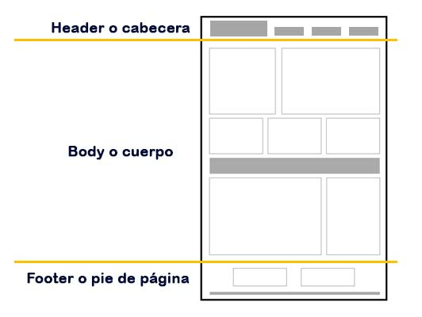
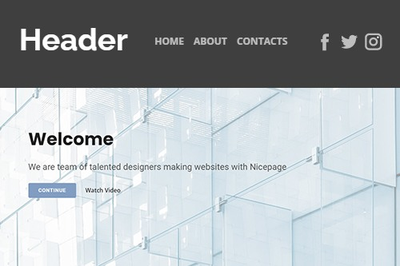
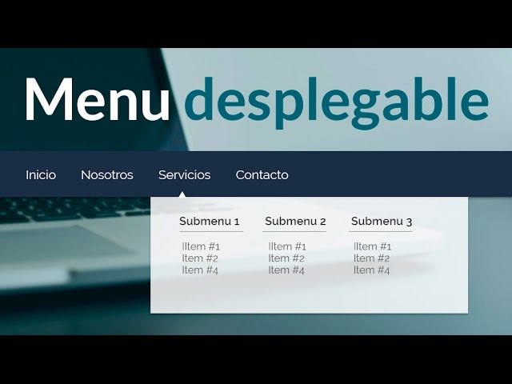
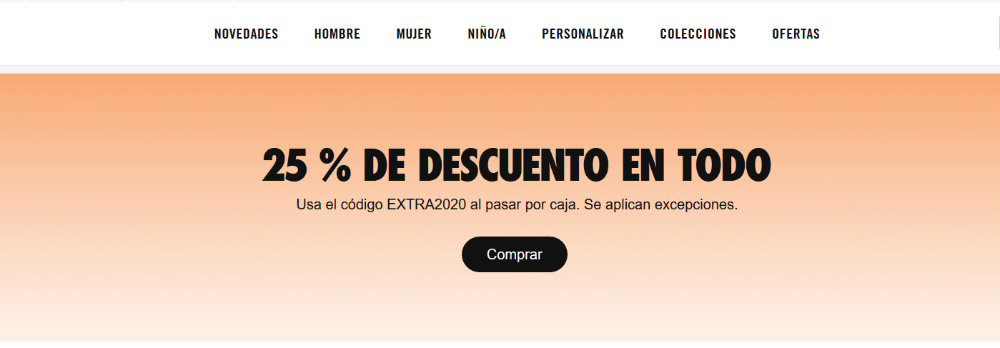
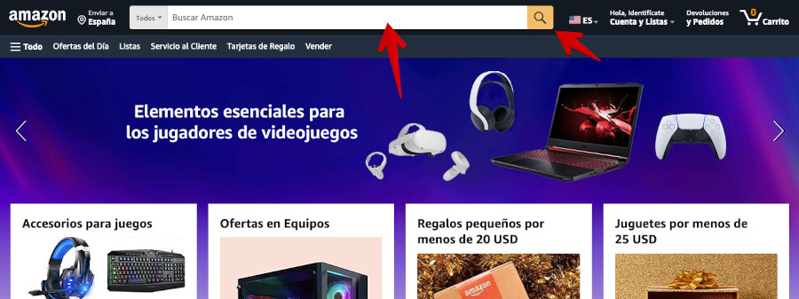
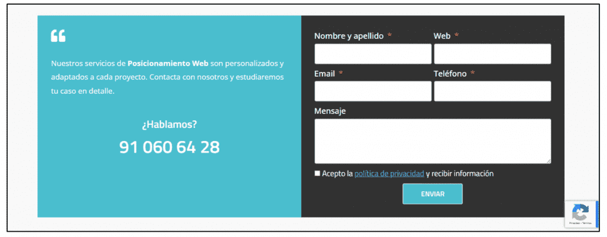
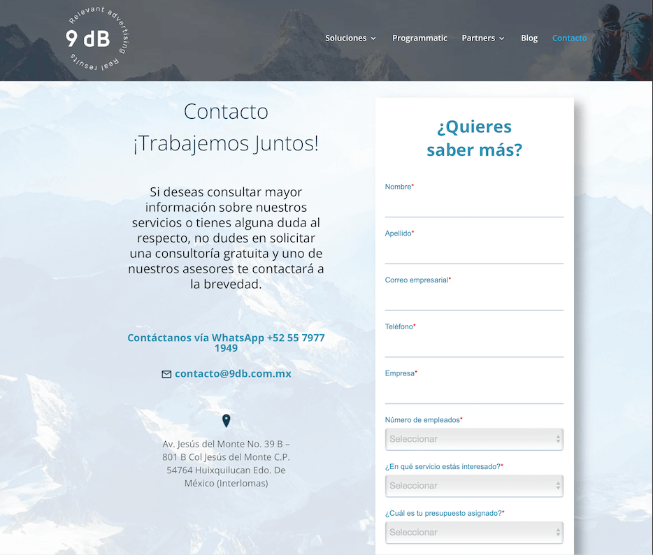
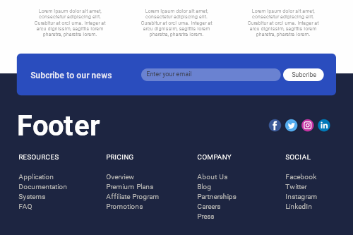

# Sitios Web

---

## ¿Qué es una página web?

---

Documento online accesible por internet que contiene información y recursos

---

## Partes de una página web

---

---

### Encabezado (Header)

---

Logo, menú navegación, llamadas acción

---

---

### Menú de navegación

---

Facilita exploración sitio

---

---

### CTA (Llamadas a la Acción)

---

Atajos visitantes realicen acciones específicas

---

---

### Imagen destacada (Hero section)

---

Zona atractiva debajo encabezado

---

---

### Buscador

---

Facilita búsqueda contenido

---

---

### Formulario

---

Recopilar información visitantes

---

---

### Icono de URL (Favicon)

---

Refuerza identidad marca

---

---

### Información de contacto

---

Facilita comunicación empresa o dueño

---

---

### Pie de página

---

Contiene enlaces útiles y términos legales

---

<!-- ### Creación con Google Sites

---

Acceso plataforma: Google Sites Google Drive. Comparación métodos acceso.

---

### Elección de Plantilla

---

Plantillas predefinidas diferentes tipos proyectos. Consejos elección plantilla adecuada.

---

### Título de la Web

---

Ubicación personalización título web. Importancia incluir logotipo imagen marca.

---

### Estructura y Páginas de la Web

---

Organización contenido: estructura páginas. Panel edición creación nuevas páginas.

---

### Opciones de Edición y Maquetación en Google Sites

---

Herramientas maquetación disponibles. Ejemplos elementos insertar web.

---

### Configuración de Google Sites

---

Acceso configuración panel edición. Personalización aspectos navegación, color logo.

---

### FAQs o Preguntas Frecuentes

---

Respuestas dudas comunes creación sitios web Google Sites.

---
 -->
