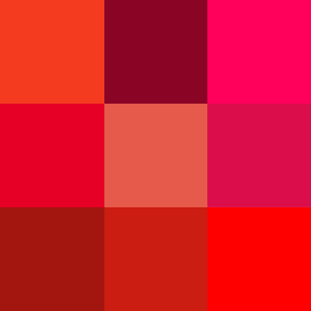
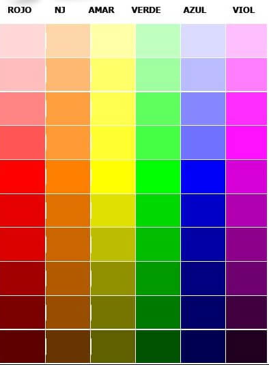
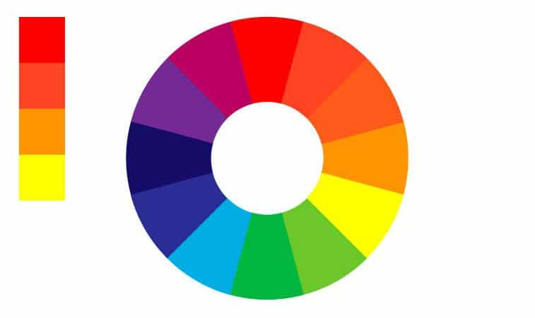

# Teoria del color

---

## La rueda de colores

---

---

### Representación visual de primarios, secundarios y terciarios

---

### Herramienta para la teoría del color

---

## Colores primarios

---

### Tradicionales: rojo, amarillo, azul

---

## Dispositivos electrónicos

---

### Uso del modelo RGB (rojo, verde, azul)

---

## Colores secundarios

---

---

### Mezcla de colores primarios

---

### Igual proporción de rojo y amarillo = Naranja

---

### Mezcla equitativa de amarillo y azul = Verde

---

### Combinación balanceada de azul y rojo = Magenta

---

## Colores terciarios

---

---

### Combinación equitativa de color primario y secundario

---

---

# Combinaciones de colores

---

---

## Utilidad de las combinaciones

* Transmitir emociones 
* Crear contrastes visuales
* Impacto en la experiencia del usuario 

---

## Tipos de combinaciones

---

### Colores análogos

* Colores adyacentes en la rueda de color
* Sensación de armonía y variedad

---

---

#### Ejemplos

* Azul y verde
* Azul y azul-violeta o amarillo-verde
* Amarillo y amarillo-naranja

---

### Utilidad 

* Sensación de cohesión y equilibrio
* Amplia gama de opciones para la paleta de colores

---

### Tríadas de colores

---

#### Conjunto de tres colores equidistantes en la rueda de color

---

---

#### Ejemplo 

Cian, naranja y morado

---

#### Características

* Contraste balanceado entre los colores
* Armonía visual en el diseño

---

### complementarios divididos

---

#### Seleccionar dos colores adyacentes al color complementario en la rueda

---

---

#### Ejemplo 

Si se elige el amarillo, en lugar de su complementario (morado), se seleccionan el azul-morado y el rojo-morado.

---

#### Características

* Contraste fuerte con el color principal

---

### Cuadrado de colores

---

#### Cuatro colores uniformemente espaciados alrededor de la rueda de color

---

---

### Ejemplo 

Azul, naranja, rojo-violeta y amarillo-verde

---

### Características 

* Esquema de color estéticamente agradable
* Funciona bien con un color dominante y versiones más claras de los otros tres colores

---

## Impacto emocional de los matices

---

### Afectan la percepción emocional del usuario

---

### El mismo color puede tener diferentes impactos según su matiz

---

### Por ejemplo, el rojo saturado es excitante, mientras que el rojo claro es calmado

---

---

## Influencia de la luminosidad y saturación:

---

### Los colores claros transmiten calma y paz

---

### Los colores oscuros evocan seriedad y drama

---

## Consideraciones culturales en la selección de colores

---

### Diferentes culturas asignan significados diversos a los colores

---

### Por ejemplo, el rojo es asociado con la buena suerte en China

---

## Colores cálidos

---

### Crean sensación de calidez y calor en diseño o imagen

---

---

### Asociados con el sol, calor, fuego y amor (pasión)

---

* Rojo: relacionado con la sangre y el calor
* Naranja y amarillo: asociados con el verano

---

## Colores fríos

---

### Connotaciones de climas fríos, invierno, muerte, tristeza, hielo, noche y agua

---

---

### Asociados con calma, tranquilidad, confianza y limpieza

---

## ejemplos con paginas web

---

### Rojo

---

### Naranja

---

### Amarillo

---

### Verde

---

### Azul

---

### Morado

---

### Blanco

---

### Negro

